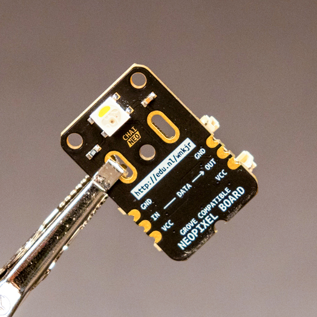

# ChaiNEO

Daisy-Chainable Breakout Boards for Neopixel Compatible LEDs

ChaiNEO provides daisy-chainable, Grove-compatible breakout boards designed for Neopixel-compatible LEDs. The version pictured above uses the [SK6812RGBW chip](https://www.adafruit.com/product/2761) that supports RGBW color instead of the P9813 chip found in the Grove RGB Chainable LEDs.

## Design Features

- **Size**: The boards are 2 by 3 cm.
- **Mounting**: There are two big slotted holes for mounting with zip ties or for routing external power.
- **Soldering Options**: On the left and right edges of the board, 3 castellated pads allow for direct board-to-board soldering, which can help avoid using cables. You can also solder to an LED strip with the same pinout and protocol (if using an RGBW Neopixel module, the strip must also be RGBW).

## Alternative Designs 

Included are alternative Gerber design files:
- Another design with the same 2x3cm size.
- A gem-shaped board with connectors on the front, making assembly easier if you have a pick and place machine.

## Additional Resources and Instructions

Further resources and usage instructions for the ChaiNEO board can be explored in detail [here](https://id-studiolab.github.io/Connected-Interaction-Kit/components/chainable-led/chainable-led-chaineo).

## Files and Documentation

Schematic files and additional documentation are available in the [Production Files](Production%20Files) subdirectory.
