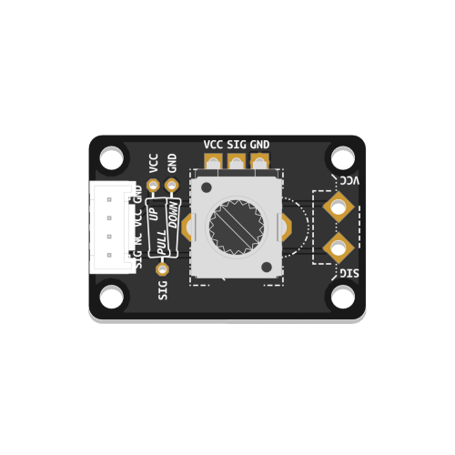
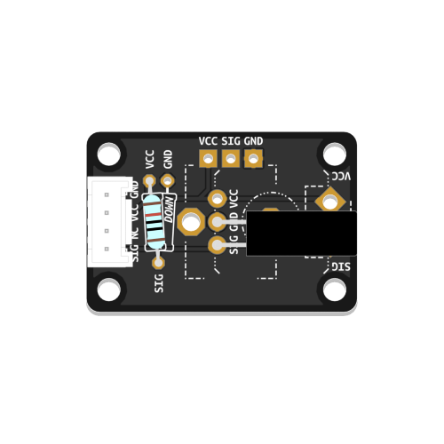
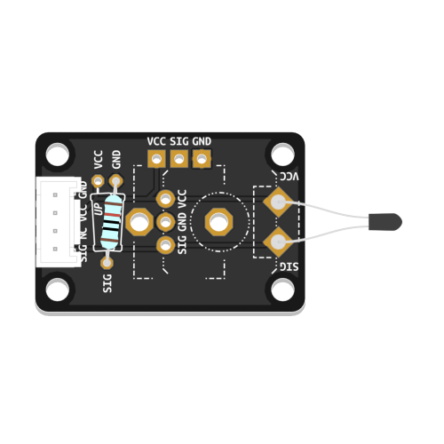
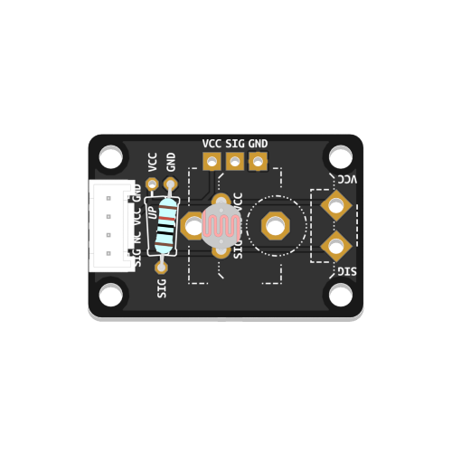
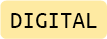

# Custom Component Board

An easy and cost-effective way to assemble and use common sensor types within the Grove ecosystem.

The **Custom Component Board** is a versatile 2 x 3 cm PCB  designed to simplify the assembly and interfacing of a wide range of  common sensors using a unified PCB design. This board necessitates basic soldering skills from its users, providing an excellent opportunity for both learning and teaching soldering techniques.

## Key Features

The board offers mounting options for a myriad of components. Below is a non-exhaustive list of examples.

It is crucial to note that **only one sensor component can be mounted on one sensor board!** Thus, a Grove header, an optional pull-up or pull-down resistor, and one sensor component of your choice can be accommodated per board.

### Dedicated Footprints:

- **Grove Header:** Can be mounted either front or back-facing, according to the required mounting situation of the component.
- **Configurable Resistor:** A flexible footprint to insert resistor configurations as needed, for pull-up or pull-down applications.
- **Tactile Switch:** Suitable for switches of a 12 x 12 mm form factor.
- **Rotary Potentiometer:** Suitable for vertical-mount rotary potentiometers, compatible with the RK09 series or equivalent models.
- **Terminal Block:** Accommodates terminal blocks with pin spacings between 3.5 and 5mm, suitable for sensor designs such as Force-Sensing Resistors, Conductive Rubber Cord Stretch Sensors, and more.

### 3-Pin Footprints:

Two 2.54mm spaced 3-pin headers are available on the board. One is centrally located, while the other is part of the potentiometer footprint. Always ensure you match your component to the available footprints! Here are some examples of compatible sensors:

- **Temperature Sensors** (e.g., TMP36)
- **Hall-Effect Sensors** (e.g., AH3363Q-P-B)

### 2-Pin Components:

The numerous mounting options on the PCB also provide multiple ways to mount 2-Pin sensor components, such as:

- **Tilt Switches**
- **Force-Sensing Resistors**
- **Thermistors**
- **Photoresistors**
- **many more...**

## Usage and Application

Visit [this page](https://id-studiolab.github.io/Connected-Interaction-Kit/components/components-custom.html) for examples, additional resources, and assembly instructions.

|                        Potentiometer                         |                        Tactile Switch                        |                         Tilt Switch                          |                          Thermistor                          |                        Photoresistor                         |
| :----------------------------------------------------------: | :----------------------------------------------------------: | :----------------------------------------------------------: | :----------------------------------------------------------: | :----------------------------------------------------------: |
|                        Position/Angle                        |                             Push                             |                             Tilt                             |                         Temperature                          |                          Brightness                          |
|  |  |  |  |  |
|   |   |   |   |   |
| [Learn More](https://id-studiolab.github.io/Connected-Interaction-Kit/components/rotary-potentiometer/rotary-potentiometer) | [Learn More](https://id-studiolab.github.io/Connected-Interaction-Kit/components/tactile-switch/tactile-switch.html) | [Learn More](https://id-studiolab.github.io/Connected-Interaction-Kit/components/tilt-switch/tilt-switch.html) | [Learn More](https://id-studiolab.github.io/Connected-Interaction-Kit/components/thermistor/thermistor.html) | [Learn More](https://id-studiolab.github.io/Connected-Interaction-Kit/components/photoresistor/photoresistor.html) |

## Version Information

- **Version 0.9**: Original design; intended for DIY PCB etching at home.
- **Version 1.0**: Design adopted for use with the Connected Interaction Kit. Designed to be produced by Fab house; utilizes 6x6 mm tactile switch footprint.
- **Version 1.1**: Updated footprint for 12x12 mm tactile switch.
