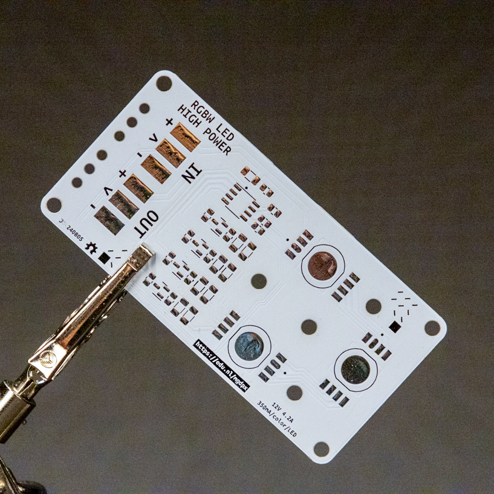

# High Power RGBW Neopixel
A 12W neopixel with extra white chip for accurate color reproduction.
It uses the UCS2904B chip to toggle the channels, can be programmed simiarly to the SK6812 chip


# Design Features
This 40x81mm PCB (aluminium PCB required for heat reduction) connects 3 high power RGBW leds in series. This makes it possible for you to power it by 12v and will get you a lot of light. it makes it possible to light up entire rooms!
It uses standard 12v neopixel strip connectors to daisy chain them together.

# Files and Documentation
Schematic files and additional documentation are available in the Production Files subdirectory.

# Code example
```
# --- Imports
import time
import board
import neopixel

# --- Variables
pin_leds = board.D13

num_leds = 3
leds = neopixel.NeoPixel(pin_leds, num_leds, auto_write=False, pixel_order=neopixel.GRBW)

# --- Functions

# --- Setup
leds.fill(0) # turn off all LEDs
leds.show()

# --- Main loop
while True:
    
    # set color values for the LEDs individually
    leds[0] = (255, 0, 0, 0) # red
    leds[1] = (0, 255, 0, 0) # green
    leds[2] = (0, 0, 255, 0) # blue
    leds.show()
    time.sleep(2)
    
    # make LEDs white
    leds.fill((0, 0, 0, 255)) # white
    leds.show()
    
    time.sleep(2)

```

# IMPORTANT: 
At this point in time we are still checking the thermals of this design, it might get a bit hot so if you reproduce this you want to propperly cool the PCB