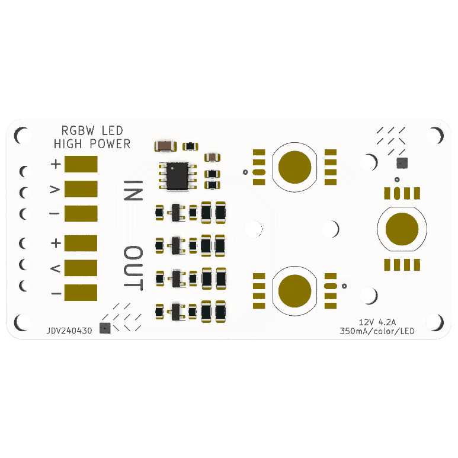

# High Power RGBW Neopixel
A 12W neopixel with extra white chip for accurate color reproduction.

# Design Features
This 40x81mm PCB (aluminium PCB required for heat reduction) connects 3 high power RGBW leds in series. This makes it possible for you to power it by 12v and will get you a lot of light. it makes it possible to light up entire rooms!
It uses standard 12v neopixel strip connectors to daisy chain them together.

# Files and Documentation
Schematic files and additional documentation are available in the Production Files subdirectory.

# IMPORTANT: 
At this point in time we are still checking the thermals of this design, it might get a bit hot so if you reproduce this you want to propperly cool the PCB