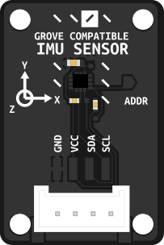

# IMU sensor based on LSM6SDS3TR

Grove-Compatible IMU Sensor board using the LSM6SDS3TR sensor



## Background

The LSM6DS3 is a 6-axis inertial measurement unit (IMU) that combines a 3-axis accelerometer and 3-axis gyroscope. It communicates via I2C and provides real-time motion data with low power consumption. The sensor is commonly used in robotics and IoT applications for motion detection, orientation tracking, and gesture recognition. The LSM6DS3TRC variant used here is optimized for embedded systems and offers high accuracy with configurable measurement ranges.

- **Type**: Integrated Sensor Board
- **Size**: 20 x 30 mm
- **Mounting**: Four 2.75mm diameter mounting holes along the top edge

## Usage Example
```python
import time
import board
from adafruit_lsm6ds.lsm6dsox import LSM6DSOX

i2c = board.I2C()  # uses board.SCL and board.SDA
sox = LSM6DSOX(i2c, address=0x6B)

while True:
    print("Acceleration: X:%.2f, Y: %.2f, Z: %.2f m/s^2"%(sox.acceleration))
    print("Gyro X:%.2f, Y: %.2f, Z: %.2f radians/s"%(sox.gyro))
    print("")
    time.sleep(0.5)
```
## Fusion Library
Jordan Boyle made a Circuitpython fusion library for the sensor providing:
-  Quaternion-based complementary filter for fusing accelerometer and gyroscope data.
-  Euler angle outputs (roll, pitch, yaw) and angular rates on demand.

It can be found [here](/IMU/fusionlibrary)

## Additional Resources and Instructions

Further resources and usage instructions for the IMU sensor boards can be explored in detail [here](https://id-studiolab.github.io/Connected-Interaction-Kit/components/imu-sensor/imu-sensor.html).

