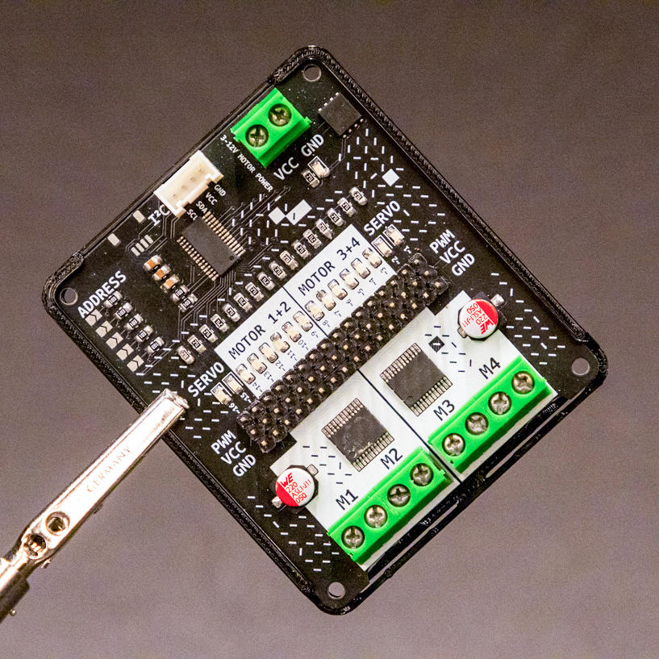

# Motor Driver
Simple I2C motor driver for Servo, DC, and Stepper motors.


# Design Features
This motor driver is the easiest way to connect anything moving to the ItsyBitsy Expander, it can drive up to 16 servos or 4 DC motors or even 2 stepper motors!

It uses the TB6612 MOSFET driver with a 1.2A per channel current capability (or 3A peak). This chip has a much lower voltage drop than the regular L293 and  has built-in flyback diodes.

Everything is controlled through I2C, making it easy on the ports and the processing of the microcontroller. With the configurable I2C addresses you can even daisychain the motor drivers, up to 32 controllers (Meaning 512 servos on 1 port and 1MCU!)

The motor driver is based on the [Adafruit Motor Shield](https://www.adafruit.com/product/1438) and with identical pinout the code works seamlessly!

Specs:

- **Up to 16 servo** motors with 12-bit resolution for each output, that means about 4us resolution at 60Hz update rate
- **Up to 4 bi-directional DC** motors with individual 8-bit speed selection (so, about 0.5% resolution)
- **Up to 2 stepper motors** (unipolar or bipolar) with single coil, double coil, interleaved or micro-stepping.
- 4 H-Bridges: TB6612 chipset provides 1.2A per bridge (3A for brief 20ms peaks) with thermal shutdown protection and internal kickback protection diodes. Can run motors on 4.5VDC to 13.5VDC.
- Adjustable frequency PWM up to about 1.6 KHz
- Motors automatically disabled on power-up
- Big terminal block connectors to easily hook up wires (18-26AWG) and power
- Polarity protected 2-pin terminal block and jumper to connect external power, for separate logic/motor supplies
- Download the easy-to-use CircuitPython and Arduino software library!
- Dimensions, assembled: 75mm x 47mm x 10mm
- This board/chip uses I2C 7-bit addresses between 0x60-0x80, selectable with jumpers.


# Files and Documentation
Schematic files and additional documentation are available in the Production Files subdirectory.


# Code examples

## CircuitPython Example LED
This goes through all LEDs on the board and fades them in and out one by one.
(from [adafruit](https://learn.adafruit.com/16-channel-pwm-servo-driver/python-circuitpython))

```python
# SPDX-FileCopyrightText: 2021 ladyada for Adafruit Industries
# SPDX-License-Identifier: MIT

import time
import board
from adafruit_pca9685 import PCA9685

# Create the I2C bus interface.
i2c = board.I2C()  # uses board.SCL and board.SDA
# i2c = busio.I2C(board.GP1, board.GP0)    # Pi Pico RP2040

# Create a simple PCA9685 class instance.
pca = PCA9685(i2c, address=0x60)

# Set the PWM frequency to 60hz.
pca.frequency = 60

def fade_led_in(channel, steps=100, delay=0.0001):
    for i in range(steps):
        # Calculate the duty cycle value (0 to 0xFFFF)
        duty_cycle = int(0xFFFF * (i / steps))
        pca.channels[channel].duty_cycle = duty_cycle
        time.sleep(delay)

def fade_led_out(channel, steps=100, delay=0.0001):
    for i in range(steps):
        # Calculate the duty cycle value (0 to 0xFFFF)
        duty_cycle = int(0xFFFF * ((steps - i) / steps))
        pca.channels[channel].duty_cycle = duty_cycle
        time.sleep(delay)
    # Ensure the LED is fully off at the end
    pca.channels[channel].duty_cycle = 0x0000

# Light up each LED one by one with a fade effect and then turn them off
while True:
    for channel in range(16):
        fade_led_in(channel)
        time.sleep(0.1)  # Optional: wait half a second after fading in
        fade_led_out(channel)
        time.sleep(0.1)  # Optional: wait half a second after fading out
```

## CircuitPython Example Servo

(from [adafruit](https://learn.adafruit.com/16-channel-pwm-servo-driver/python-circuitpython))

```python
# SPDX-FileCopyrightText: 2021 ladyada for Adafruit Industries
# SPDX-License-Identifier: MIT

"""Simple test for a standard servo on channel 0 and a continuous rotation servo on channel 1."""
import time
from adafruit_servokit import ServoKit

# Set channels to the number of servo channels on your kit.
# 8 for FeatherWing, 16 for Shield/HAT/Bonnet.
kit = ServoKit(channels=16, address=0x60)

kit.servo[0].angle = 180
time.sleep(1)
kit.servo[0].angle = 0
time.sleep(1)
```

## CircuitPython Example  DC motor
turn motor 1 full throttle forward
(from [adafruit](https://learn.adafruit.com/adafruit-motor-shield-v2-for-arduino/python-circuitpython))

```python
# SPDX-FileCopyrightText: 2021 ladyada for Adafruit Industries
# SPDX-License-Identifier: MIT

"""Simple test for using adafruit_motorkit with a DC motor"""
import time
import board
from adafruit_motorkit import MotorKit

kit = MotorKit(i2c=board.I2C())
while True:
    kit.motor1.throttle = 1.0
    time.sleep(1)
    kit.motor1.throttle = 0
    time.sleep(1)
    kit.motor1.throttle = -1.0
    time.sleep(1)
    kit.motor1.throttle = 0
    time.sleep(1)
```

## CircuitPython Example Stepper motor
turn 100 steps with a stepper motor
(from [adafruit](https://learn.adafruit.com/adafruit-motor-shield-v2-for-arduino/python-circuitpython))

```python
# SPDX-FileCopyrightText: 2021 ladyada for Adafruit Industries
# SPDX-License-Identifier: MIT

"""Simple test for using adafruit_motorkit with a stepper motor"""
import time
import board
from adafruit_motorkit import MotorKit

kit = MotorKit(i2c=board.I2C())

for i in range(100):
    kit.stepper1.onestep()
    time.sleep(0.01)

```