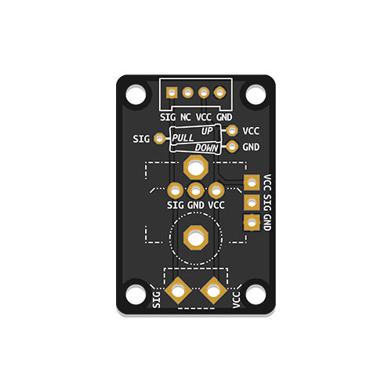
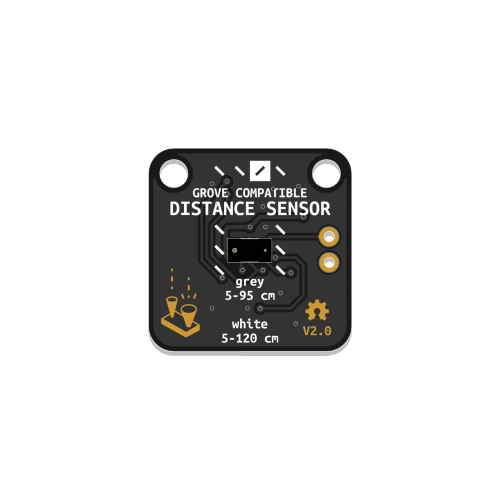
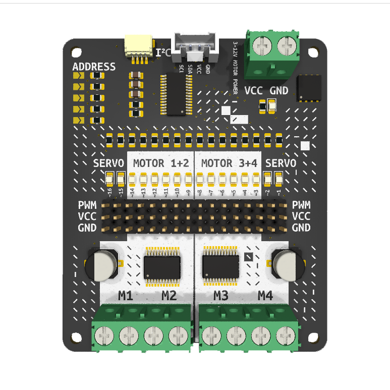
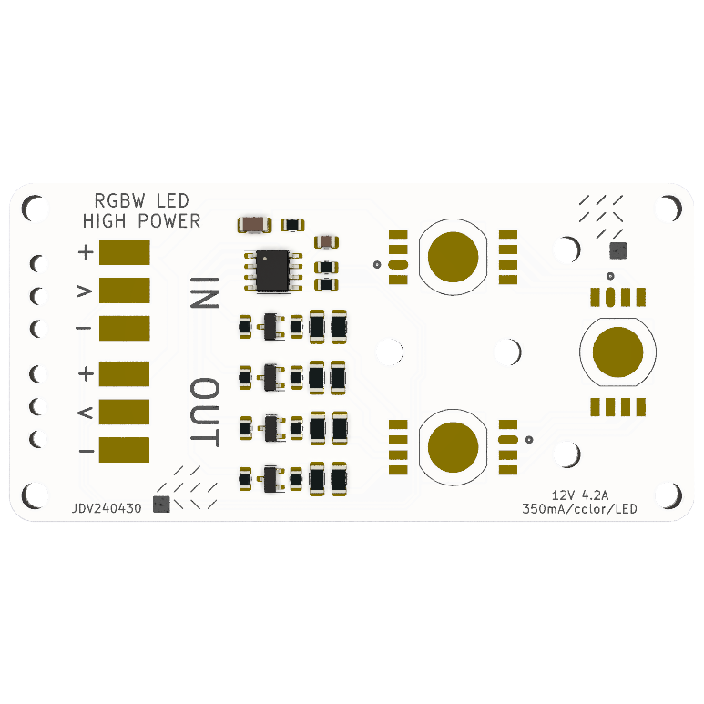

# EduGroveModules

A collection of Grove-compatible modules, designed specifically for educational needs. 

  
  
  
    
  </a>
    

## Grove-Compatible Modules for Education

These designs are tailored for use in the [**Connected Interaction Kit**](https://id-studiolab.github.io/Connected-Interaction-Kit) and beyond, offering specific functionalities and optimizations to enhance hands-on learning in tech and design education.

## Modules Overview

### [**Custom Component Board**](CustomComponents/README.md)

A versatile 2x3 cm PCB for easy assembly and interfacing of common sensors, demanding basic soldering skills. Useful for educational soldering practices.

### [**Time-of-Flight Distance Sensor**](Time-of-Flight/README.md)

Cost-effective, Grove-compatible boards for the VL53L0X sensor, enabling precise distance measurements up to 2 meters.

### [**ChaiNEO**](ChaiNEO/README.md)

Daisy-chainable, Grove-compatible boards designed for Neopixel-compatible LEDs.

### [**MotorDriver**](MotorDriver/README.md)

Simple I2C motor driver for servo,DC, and stepper motors.