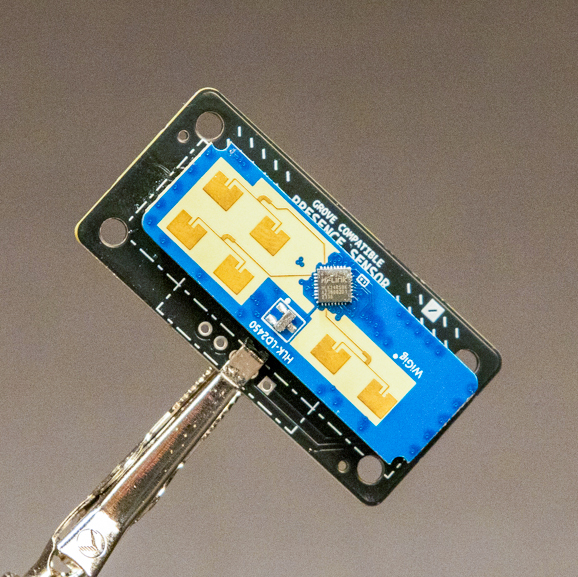

# Presence Sensor
An adapter board for the LD2410 or LD2450 to make it Grove compatible for the Itsy Bitsy! It has an integrated 5v boost circuit to power the radar sensors


# Design Features
This 50x25mm PCB makes it easy to interface with the LD2410 and LD2450 radar sensors, uart is directly routed to the corresponding pins. The 5v for the modules is created from the 3.3v supply with the help of the MIC2288 chip.

# Files and Documentation
Schematic files and additional documentation are available in the Production Files subdirectory.

# Code example
```
import time
import board
import busio
from ld2410 import LD2410

# Initialize UART for communication with the LD2410 sensor
uart = busio.UART(board.TX, board.RX, baudrate=256000)

# Create an instance of the LD2410 class
ld2410 = LD2410(uart)

# Read Firmware Version
ld2410.read_firmware_version()

# Wait for a moment
time.sleep(1)

def main():
    while True:
        # Update the sensor data
        ld2410.update()
        
        # Print out the parsed data
        print("Target State:", ld2410.target_state)
        print("Moving Distance:", ld2410.moving_distance, "cm")
        print("Moving Energy:", ld2410.moving_energy)
        print("Stationary Distance:", ld2410.stationary_distance, "cm")
        print("Stationary Energy:", ld2410.stationary_energy)
        print("Detection Distance:", ld2410.detection_distance, "cm")
        print("-" * 40)
        
        # Delay before the next update
        time.sleep(5)

if __name__ == "__main__":
    main()
```

# Status
This project is still in development. 
